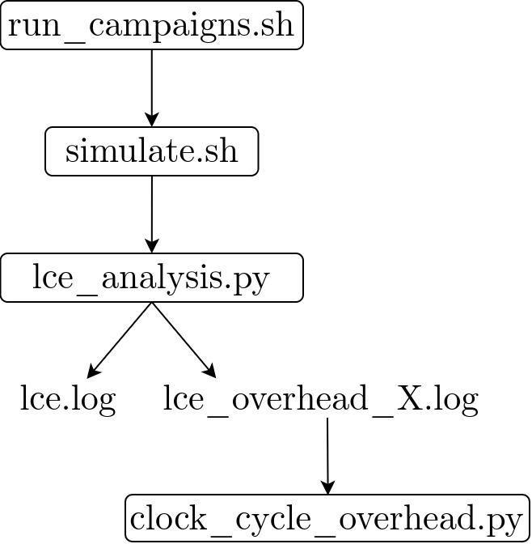

# Scripts for simulation


## Folder organization

The `scripts` folder is organized as follows:
```
.
├── simulate.sh                 // simulate one execution
├── run_campaigns.sh            // simulate a campaign of executions
├── clean_everything.sh         // clean ../log folder and core-v-verif framework
├── lce_analysis.py             // analysis of one simulation outputs
├── clock_cycle_overhead.py     // plot clock cycle overheads of a campaign
├── lce_strategies.txt          // list of linear execution strategies for LCE
└── README.md
```

The `simulate.sh` script runs a simulation of the code execution according to the given parameters.

The `lce_analysis.py` script is automatically call by `simulate.sh` at the end of the simulation of execution to analyze its outputs. Analysis is available in `../log/` folder.

The `run_campaigns.sh` script calls several times `simulate.sh` with various parameters.

By vary the Worst Wanted Detection Latency with `run_campaigns.sh --overhead` the graph of the clock cycle overheads can be plotted by `clock_cycle_overhead.py`.

The `clean_everything.sh` script remove `../log/` folder content and clean the core-v-verif framework.

<p align="center">
    
</p>

## Getting Started

To quickly get familiar with execution simulations, follow the instructions above. They gradually present all the simulation features.

1. Simulate [crc32](#code_name) code execution on unprotected core without performing LCE.
   ```sh
   ./simulate.sh -c crc32 -r INIT -a 0
   ```

2. The `../log/lce.log` was updated by adding analysis of simulation output. Details about [log files formatting](#log-files) are available.
   ```sh
   less ../log/lce.log
   ```

3. Simulate crc32 code execution on unprotected core with performing LCE with [strategy I](#linear-code-execution-attack-strategies-[-a-%2F---attacks]). The `../log/lce.log` file was updated and shows that 100% of the code in memory was extracted.
   ```sh
   ./simulate.sh -c crc32 -r INIT -a 1
   ```

4. Simulate in verbose mode. The comparison between original and extracted instructions is printed. The localization of the original code is presented [bellow](#code_name).
   ```sh
   ./simulate.sh -c crc32 -r INIT -a 1 -v
   ```

5. Simulate with generation of waveform. The generated waveform is available on `../core-v-verif/cv32e40p.sim/core/verilator_tb.vcd`. [GTKWave](https://gtkwave.sourceforge.net/) is recommended to open waveform.
   ```sh
   ./simulate.sh -c crc32 -r INIT -a 0 -w
   ```

6. Simulate execution on protected core with SMM (WWDL=15) while LCE with [strategy I](#linear-code-execution-attack-strategies-[-a-%2F---attacks]) is performing. The `../log/lce.log` shows that the detection latency was 15 executed instructions.
   ```sh
   ./simulate.sh -c crc32 -r SMM -l 15 -a 1 -v
   ```

7. Run a campaign of simulations of execution of crc32 and nettle-aes codes. Unprotected core and protected by the three countermeasures cores (with WWDL equal to 15, 30 then 60) will execute codes. LCE will be no performing, and performing with its three strategies.
   ```sh
   ./run_campaign.sh -c "crc32 nettle-aes" -r "INIT LAM SMM DIM" -l "15 30 60" -a "0 1 2 3"
   ```

8. Run a campaign of simulation to plot the clock cycle overhead. The analyzed outputs are written into a new `../log/lce_overhead-<X>.log` file.
   ```sh
   ./run_campaign.sh -c "mont64 md5sum" -r "INIT SMM DIM" -l "10 15 20 25 30 60" -a 0 -o
   ```

9. Plotting the last already computed overhead campaign. Display the help to discover option -i and -l, useful to plot a specific already computed overhead campaigns.
   ```sh
   python3 clock_cycle_overhead.py all
   python3 clock_cycle_overhead.py all -h
   ```

10. Plot an already computed overhead campaign by ourselves, containing 24 codes, for large number of WWDL. This campaign was getting by executing `./run_campaign.sh -r "INIT SMM DIM" -a 0 -o`.
   ```sh
   python3 clock_cycle_overhead.py all -l ../log/already_computed/lce_overhead__INIT-SMM-DIM__wwdl_6-150.log
   ```

10. As the graph contains too many curves to be readable, plot the average of codes for both countermeasures. 
   ```sh
   python3 clock_cycle_overhead.py all -l ../log/already_computed/lce_overhead__INIT-SMM-DIM__wwdl_6-150.log -a
   ```

11. Finally, explore the already computed log file `../log/already_computed/lce__INIT-LAM-SMM-DIM__a_0-1-2-3__wwdl_10-100.log` getting by executing `./run_campaign.sh -r "INIT LAM SMM DIM" -a "0 1 2 3" -l "10 15 20 25 30 35 40 45 50 55 60 65 70 75 80 85 90 95 100`

12. To remove all log generated and to clean core-v-verif use:
   ```sh
   ./clean_everything.sh 
   ```


## Log files

For every simulation a line is added at the bottom of `../log/lce.log` file, as illustrated bellow. Main [simulation parameters](#simulation-parameters) and [simulation outputs](#simulation-outputs) are given in columns. As `run_campaigns.sh` runs several simulations, several lines will be added.

Executing `run_campaigns.sh` with option `-o/--overhead` will create and generate outputs in a new file `../log/lce_overhead-<X>.log` with a new index X.


``` bash
----------------------------------------------------------------------------------------------------------
                        RTL   A  WWDL   Delay   Code_name         Extracted   Alarm  Last_cycle  Last_addr
----------------------------------------------------------------------------------------------------------
[2022-10-28 19:15:50] |INIT| |0| |  | |     0| md5sum                       |      | |  340545| |   0x888|
[2022-10-28 19:24:07] |INIT| |1| |  | |     0| crc32                  100 % |      | |   15380| |  0x1e8c|
[2022-10-28 19:16:22] | LAM| |3| |10| |    24| dhrystone                1 % |    10| |      10| |    0xa0|
[2022-10-28 19:18:09] | DIM| |2| |20| |     0| md5sum                   1 % |    20| |      20| |    0xcc|
```


## Simulation parameters

The main simulation parameters for `simulate.sh` and `run_campaigns.sh` scripts are detailed. 


### RTL [ -r / --rtl ]
Select which [core version(s)](https://github.com/anonymous-submission002/cv32e40p_rtl/tree/dim_cv32e40p) will be used for simulation.

### Linear code execution attack strategies [ -a / --attacks ]
Select which attack strategies will be used to ensure a Linear Code Extraction.
Three different strategies lead to a linear execution.
*Force* statement used in [`../core-v-verif/cv32e40p/tb/core/tb_top_verilator.sv`](../core-v-verif/cv32e40p/tb/core/tb_top_verilator.sv) emulates the microprobes.
The option `--attacks 0` do not enable LCE.


|           Strategy          	|                                                                                     Forcing                                                                                    	|
|:---------------------------:	|:------------------------------------------------------------------------------------------------------------------------------------------------------------------------------:	|
|        (I) - Feezing       	| cv32e40p_core_i.if_stage_i.prefetch_buffer_i.instruction_obi_i.resp_rdata_o[6]=1'b0<br>cv32e40p_core_i.if_stage_i.prefetch_buffer_i.instruction_obi_i.resp_rdata_o[4:2]=3'b101 	|
|   (II) - Instruction edits  	|                                                                 cv32e40p_core_i.if_stage_i.instr_valid = 1'h0                                                                 	|
| (III) - Linear mode forcing 	|                                                                   cv32e40p_core_i.id_stage_i.pc_set_o = 1'h0                                                                   	|

<p align="center">
    
</p>


### Worst Wanted Detection Latency [ -l / --wwdl ]
Select which Worst Wanted Detection Latency is used to initialized LAM, SMM or DIM counters. The WWDL defines WWDL parameter in [test bench](https://github.com/anonymous-submission002/linear_code_extraction/blob/main/simulation/core-v-verif/cv32e40p/tb/core/tb_top_verilator.sv#L206). 


### Delay [ -d / --delay_lce ]
Select the delay in instruction before the beginning of ensuring the linear execution mode. For attack 3, it is necessary to wait the execution of the first JUMP to pass around exit instructions.

### Code_name [ -c / --codes ]
Select the name of the code(s) to be executed. The CORE-V-VERIF codes are available. We select only the two of them which are not tests but real codes. All the [Embench](https://github.com/embench/embench-iot) codes are available as they are representative of embedded codes.  

#### Core-v-verif
- [dhrystone](../core-v-verif/cv32e40p/tests/programs/custom/dhrystone)
- [fibonacci](../core-v-verif/cv32e40p/tests/programs/custom/fibonacci)

#### Embench
- [crc32](../core-v-verif/cv32e40p/tests/programs/custom/crc32)
- [cubic](../core-v-verif/cv32e40p/tests/programs/custom/cubic)
- [edn](../core-v-verif/cv32e40p/tests/programs/custom/edn)
- [huffbench](../core-v-verif/cv32e40p/tests/programs/custom/huffbench)
- [matmult-int](../core-v-verif/cv32e40p/tests/programs/custom/matmult-int)
- [md5sum](../core-v-verif/cv32e40p/tests/programs/custom/md5sum)
- [minver](../core-v-verif/cv32e40p/tests/programs/custom/minver)
- [mont64](../core-v-verif/cv32e40p/tests/programs/custom/mont64)
- [nbody](../core-v-verif/cv32e40p/tests/programs/custom/nbody)
- [nettle-aes](../core-v-verif/cv32e40p/tests/programs/custom/nettle-aes)
- [nettle-sha256](../core-v-verif/cv32e40p/tests/programs/custom/nettle-sha256)
- [nsichneu](../core-v-verif/cv32e40p/tests/programs/custom/nsichneu)
- [picojpeg](../core-v-verif/cv32e40p/tests/programs/custom/picojpeg)
- [primecount](../core-v-verif/cv32e40p/tests/programs/custom/primecount)
- [qrduino](../core-v-verif/cv32e40p/tests/programs/custom/qrduino)
- [sglib-combined](../core-v-verif/cv32e40p/tests/programs/custom/sglib-combined)
- [slre](../core-v-verif/cv32e40p/tests/programs/custom/slre)
- [st](../core-v-verif/cv32e40p/tests/programs/custom/st)
- [statemate](../core-v-verif/cv32e40p/tests/programs/custom/statemate)
- [tarfind](../core-v-verif/cv32e40p/tests/programs/custom/tarfind)
- [ud](../core-v-verif/cv32e40p/tests/programs/custom/ud)
- [wikisort](../core-v-verif/cv32e40p/tests/programs/custom/wikisort)


## Simulation outputs

The interesting simulation outputs are detailed.

### Extracted
The percentage of correct extracted code is computed by comparing the original and the extracted codes.

### Alarm
The number of cycle which alarm was triggered. If there is no number, the alarm was not trigger.

### Last_cycle
The number of the last cycle. As the simulation is stopped when the alarm is triggered, the number is equal to number in alarm when it was triggered.

### Last_addr
The address of the PC at the last cycle.
